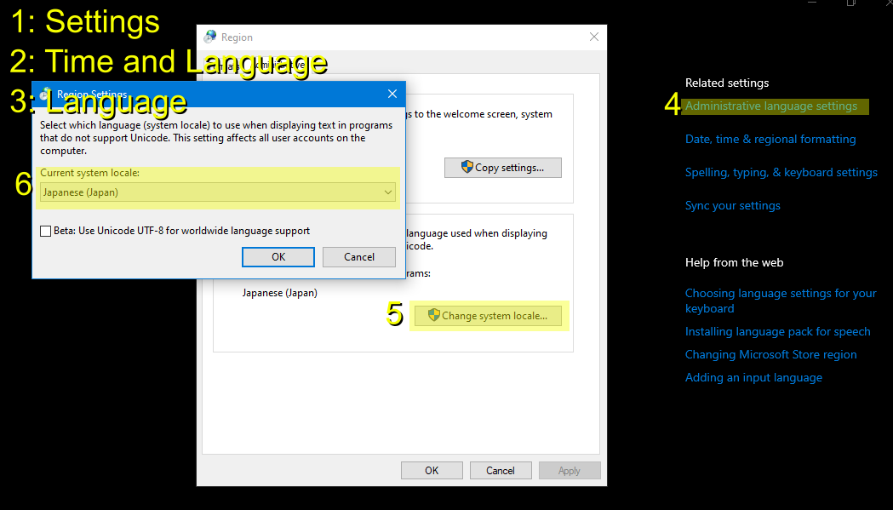

## Text encoding

Almost all text in the original game files is encoded as [Shift_JIS](https://en.wikipedia.org/wiki/Shift_JIS) and does not display properly on modern Engllish systems.

You can enable Shift_JIS in Windows 10 by setting your system locale to Japenese:

You'll have to use 7zip to decompress the LZH archive again once you restart.

You can also use [tools/text-to-utf8](/tools-dev/text-to-utf8.py) to convert Shift_JIS text files to UTF-8.

## Touhou 06 - Trial 0.13

Download here: http://www16.big.or.jp/~zun/html/th06.html ([direct](http://www16.big.or.jp/~zun/data/soft/kouma_tr013.lzh))

```
77ea64ade20ae7d890a4b0b1623673780c34dd2aa48bf2410603ade626440a8b kouma_tr013.lzh
```

```
ea8d5c1072f41885ed487a3729202e8c61291c479d5e9ac06b1245f326a4cb2d custom.exe
40df1c67fc8ca9a8e942421e10c09003d724e8819e41923ec156a25b51f83a1f custom.txt
ae3744a5beb17a7635047465085f99fc5cc3f716df772fb4486d56f71846aedd readme.txt
2b3bdf4736051c7095b9b985902916ba8c23ed60c1b9092c24696de93eb7d32a taiken.txt
de6ab99ed3a09aad501d1b66d23db69132253d16903caea976c98dbbf8786f36 マニュアル/html/bonus.html
5163d8013651d38f44a560db777e6e7d2e279531ea90278bdbd35e5d7d006fbb マニュアル/html/chara.html
a5fa60ed29f0e297c60f6ab60c8ba8867990575006d96789ce40f42c3d4bed74 マニュアル/html/controll.html
3d31c744559edd344f4055e623c97d0a78732ade42985b989c5e2547ddb82a77 マニュアル/html/faq.html
46bb4f9a4abc5e0e9b4050fb7bb221ed77cb329abd674f96332e4c4cb25620af マニュアル/html/img00.jpg
6f5ae8d5eaac1f155580303ef0c90455ef2561876c73ed0ebb0b1493734c1836 マニュアル/html/img06.jpg
e193a1e82efc3dcb86c334bbef4c8e6f20ed07c15939364072119828cfe29959 マニュアル/html/item.html
2e546663d36a06b66f5e054d5ecfb4e867a2448d0d179076d53abd6bdb5813bd マニュアル/html/menu.html
1435a921b6bf3b204295af0b477b31c471ccc4402cebde6a07869a835360160c マニュアル/html/op00.jpg
a84b1f745019c45dfefd3ceba9ff35925b39b0b30d919a35f810e9bd757a2409 マニュアル/html/op01.jpg
7f74048091caa01d755679ef2dfeb792bfb63ac0fb958d457609a78cef01af94 マニュアル/html/option.html
955cc4a9b6e0aac739c28b65052c8b1eecd2a18bcff5bc7f7098590a842fc65e マニュアル/html/rule.html
bd7a9ad5bfec16524edd7ba81f05a1f6b175778148a9e8d3bed71db24a748d87 マニュアル/html/select.html
350ee84bda24a4b507b4df04c76a075e60e26e54de936eb4f1131f1a83e36677 マニュアル/html/sl00.jpg
1cb41f8c5a330fc18bc6f8602cb0e9814ab4c3dcc4906b3633bbbc7205ec6b8a マニュアル/html/sl01.jpg
8e5e524ce963cbe66c622aa2b46efc09fb8d81bd6fb004982410a8d873c136f5 マニュアル/html/sl02.jpg
e120bc85c7392d75a332c67b1f8b5beb2447e2bb03722c49e783f17a2918d138 マニュアル/html/sl03.jpg
f7ee71ed925e757e383780de151d8ee1886fe9d2f1d48a08183a99d7496984d1 マニュアル/html/story.html
22fb78ca8ec6880724bbecbb9934dee36a8d5570cd2304e1cd986b74a2e8f07d マニュアル/html/subsys.html
f38e3e657efcb2ba524d42593ba5edacfdf143dc46542927c6eb9a75f2fc85eb マニュアル/html/title.html
53facac6d6ded1177ffca65743795af839eb4363bc49b55c68d4ba3c882af161 マニュアル/html/tl00.jpg
ce8243a363b77cb5fd0c8112ae3973ffa170bcb2b015b7ca517dfeae152a852c マニュアル/html/top.html
71b28c9010e0dcfc5904078ec4db789b25358fbaa68956c689c12cf388a46093 マニュアル/html/view.html
093a65c048c533b6a1e492e07182fabfb0cfaa36650f6ef799edfe450334c8ea マニュアル/index.html
21cddb2b5a7dfaf38e542b707873a35b3fbfd38c1aa21d5b969e1a49a1855f4b 東方紅魔郷.exe
7ba74b8f6675ef1d4a261f253ab5251009785a2e283cc8cd70d11e998bcf7559 紅魔郷CM.DAT
0f05e08e4ab94fb1308aaf4ed74d8c014a4ea00953cd893e586e3a0bec1abcdf 紅魔郷IN.DAT
a256c39269449e77c364748c306789023c92ec852fd288a6849a6a075036ba2b 紅魔郷MD.DAT
be9bdd187fa29c8980e2ebac2ef40311a512ede7477bdcbe3156fe66c4167b78 紅魔郷ST.DAT
2bba2b8317ad580b767ef91cf585d51b1593da1e63fa759a09b542de1bc85dc7 紅魔郷TL.DAT

```

## PBG3 Archives

Prior work: https://hg.linkmauve.fr/touhou/file/tip/formats/src/th06/pbg3.rs